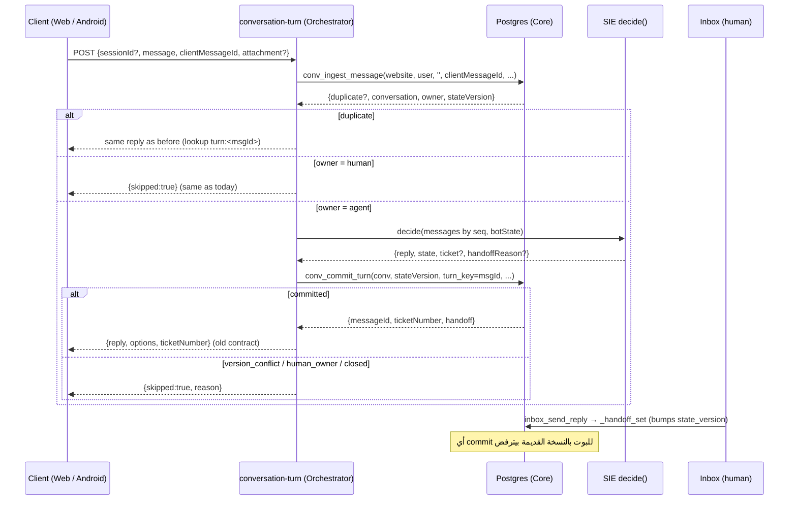

# Conversation Core (064): الشرح الكامل، الفجوات، وخطة استبدال `chat-bot-reply`

> **تاريخ:** 2026-10-06 · **المصادر:** `migrations/064_conversation_core.sql`، `tests/sql/conversation-core.test.sql`، 059–063، `supabase/functions/chat-bot-reply`، واستعلامات قراءة فقط على الإنتاج.
>
> **تصحيح لتقرير التدقيق:** كتبت هناك إن 064 «مطفي (الأعلام false)». الحقيقة أسوأ: **064 مش مطبّق على الإنتاج خالص**. سجل الترحيلات في الإنتاج بيقف عند `063_whatsapp_inbound_idempotency` وبعده `065a..e` و`066a..c`. عمود `seq` مش موجود، ولا الدوال `conv_*`، ولا الأعلام في `sie_settings`. `[إنتاج]`

---

## 1. Conversation Core بيعمل إيه؟ (في جملة)

بيخلّي **قاعدة البيانات هي الحَكَم الوحيد على المحادثة**. أي رسالة داخلة وأي رد بوت وأي تسليم لإنسان بيعدّي على 4 دوال ذرّية في Postgres. الدوال دي بتضمن 4 حاجات بغض النظر مين اللي كاتب: الموقع، أندرويد، تيليجرام، أو SIE:
- **مفيش تكرار:** نفس الرسالة الواردة مرتين بتتسجّل مرة واحدة، ونفس رد البوت مرتين بيتسجّل مرة واحدة.
- **مفيش حالة ضايعة:** ردّين متزامنين مايقدروش يكتبوا فوق بعض.
- **مفيش بوت بيتكلم بعد ما الإنسان استلم.**
- **كل دور (turn) بيتسجّل كله أو مايتسجّلش خالص.** ده بيشمل الرد والحالة والتذكرة والتسليم والحدث.

---

## 2. المكوّنات بالتفصيل

### ① أعمدة جديدة (كلها nullable أو default ثابت، يعني إضافة بس)

| الجدول | العمود | وظيفته |
|---|---|---|
| `chat_sessions` | `channel` | `website` (بيشمل الودجت وأندرويد) أو `telegram`. لو NULL يبقى جلسة قديمة |
| | `external_thread_id` | معرّف المحادثة عند القناة (chat id في تيليجرام، `''` للموقع) |
| | `state_version` | عدّاد بيزيد مع كل رسالة عميل وكل رد متسجّل وكل تسليم. **ده قلب التصميم** |
| | `channel_identity_id` | ربط بـ `channel_identities` |
| `chat_messages` | `seq` | ترتيب الرسالة جوه المحادثة (1، 2، 3…) |
| | `external_id` | مفتاح منع التكرار. للعميل: معرّف الرسالة عند القناة. للبوت: `turn:<key>` |
| | `metadata` | أجزاء الرسالة (`parts`) وبيانات المصدر |
| | `delivery_state/attempts/error/provider_message_id/updated_at` | آلة حالة الإرسال للقنوات الخارجية |

وفيه **حارس** (`guard_conversation_core_columns`) بيمنع `anon/authenticated` من كتابة أي عمود من دول. يعني المتصفح مايقدرش يزوّر `seq` ولا `state_version` ولا حالة إرسال.

### ② الترتيب: `conv_assign_seq` (trigger على كل insert)
بيقفل صف الجلسة `FOR NO KEY UPDATE` وبعدين بيحسب `max(seq)+1`. القفل ده **هو نفس القفل** اللي حارس رد البوت (059) بياخده. علشان كده مفيش ترتيب أقفال جديد يعمل deadlock، والملف بيقول ده صراحة. الـ trigger بيشتغل على **أي** مسار، حتى القديم.

### ③ فهارس فريدة كشبكة أمان
- `(session_id, seq)`: مستحيل رسالتين بنفس الترتيب.
- `(session_id, external_id)`: مستحيل نفس الرسالة الخارجية مرتين.
- `(user_id, channel, external_thread_id) where active`: **محادثة نشطة واحدة** لكل عميل لكل قناة.

### ④ الأحداث في نفس المعاملة (triggers)
- رسالة جديدة بتولّد `message_received` أو `agent_replied` أو `human_reply` في `inbox_events`.
- جلسة جديدة بتولّد `conversation_created`.
- إقفال الجلسة بيولّد `closed` **مرة واحدة**. الـ trigger مؤجّل (`deferrable initially deferred`) وبيتأكد إن `inbox_close` ماسجّلش الحدث بالفعل.
- تسليم إنسان↔بوت بيزوّد `state_version`. **ده بالظبط اللي بيمنع بوت بدأ يفكّر قبل التسليم إنه يتكلم بعده.**

### ⑤ `conv_ingest_message`: رسالة عميل داخلة
1. تحقق من المدخلات (قناة معروفة، حساب، `external_id` إلزامي، شكل `parts/metadata`).
2. `pg_advisory_xact_lock` على مفتاح المحادثة `(user, channel, thread)`، فكل الإدخالات لنفس المحادثة بتتسلسل.
3. **فحص التكرار قبل أي كتابة.** لو `external_id` اتشاف قبل كده بيرجّع `duplicate: true` ومعاه الرسالة الأصلية. والفحص بيشمل الجلسات المقفولة كمان.
4. إيجاد المحادثة بالترتيب ده:
   - المحادثة النشطة على Core.
   - **لو مفيش:** «تبنّي» جلسة قديمة نشطة (`channel is null`) من غير أي ترحيل بيانات.
   - **لو مفيش:** إنشاء محادثة جديدة.
   - ولو المحادثة النشطة أقدم من `p_idle_after` بتتقفل وتتفتح واحدة جديدة.
5. إدراج الرسالة (بتاخد `seq` من الـ trigger) وزيادة `state_version`.
6. بيرجّع: المحادثة، الرسالة، **المالك (agent/human)**، و`stateVersion`.

### ⑥ `conv_commit_turn`: تسجيل رد الوكيل ذريًا
تحت قفل صف الجلسة:
1. نفس `turn_key` اتسجّل قبل كده؟ بيرجّع نفس النتيجة ومايكتبش رد تاني (idempotent).
2. المحادثة مقفولة؟ يبقى `committed:false, reason:'closed'`.
3. مع إنسان؟ يبقى `committed:false, reason:'human_owner'`.
4. `state_version ≠ expected`؟ يبقى `committed:false, reason:'version_conflict'`.
5. غير كده، **في معاملة واحدة:** تذكرة (اختياري) + رسالة البوت + `bot_state` + زيادة النسخة + تسليم لإنسان (اختياري، عبر `_handoff_set` الرسمي بتاع 059) + حدث.

**الرفض مش exception.** الدالة بترجّع سبب ومفيش أي أثر بيتكتب. ده بيخلّي الـ caller يقرر بهدوء.

### ⑦ `conv_claim_delivery` / `conv_record_delivery`: الإرسال للقنوات الخارجية
- **Claim:** `pending|failed` تتحول لـ `sending` (والمحاولات +1). لو حالة `sending` قعدت أكتر من الـ lease (دقيقتين) يبقى المُرسِل وقع، فحد تاني يقدر يطالب بيها. ده **at-least-once مقصود وموثّق**.
- **Record:** للأمام بس (`sent → delivered → read`). `sent/failed` لازم معاهم **رقم المحاولة**. يعني مُرسِل قديم انتهت مهلته مايقدرش يكتب فوق نتيجة المحاولة الجديدة (**attempt fencing**). وإشعارات المزوّد المكررة مابتعملش حاجة.

### ⑧ الأعلام
`core_ingest_website`، `core_ingest_telegram`، `agent_runtime_enabled`: كلهم `false` و`on conflict do nothing`، يعني إعادة تشغيل الترحيل مابترجّعش علم حد فتحه.

### ⑨ التحقق الذاتي + التراجع
الترحيل نفسه بيفشل لو أي دالة اتفتحت للعميل، أو trigger ناقص، أو فهرس ناقص. وفيه `_rollback/064_conversation_core.down.sql` بيشيل الحدود ويسيب البيانات.

---

## 3. ليه اعتبرته أفضل تصميم في المشروع؟

1. **الضمانات في المكان الصح.** باقي المشروع بيوزّع القواعد على المتصفح والـ Edge والـ DB. هنا الـ invariants جوه Postgres، فأي كاتب لازم يلتزم بيها، حتى كود مكتوب بعدين أو دالة منشورة من غير مصدر.
2. **Idempotency على الطرفين:** الوارد (`external_id` في نطاق المحادثة، فعميل مايقدرش «يحجز» معرّف عميل تاني)، والصادر (`turn_key`).
3. **Optimistic concurrency حقيقي** بـ `state_version`. ده بيحل 3 مشاكل بآلية واحدة: رسالتين متزامنتين، إعادة محاولة قديمة، واستلام إنسان أثناء تفكير البوت.
4. **Atomic turn.** دلوقتي `create_ticket_with_message_and_session_update` بيعمل تذكرة ورسالة وحالة، **بس من غير نسخة ولا idempotency** (`p_turn` في `persist_bot_turn` **مش مستخدم أصلًا**؛ اتأكدت من نص الإنتاج). يعني retry من SIE النهارده = رد مكرر وتذكرة مكررة. 064 بيقفل ده.
5. **احترام اللي قبله:** نفس قفل 059، التسليم عبر `_handoff_set` الرسمي، وحدث الإقفال مايتكررش مع `inbox_close`. مفيش تصميم موازي.
6. **التشغيل الآمن:** إضافة بس، أعلام مقفولة، re-runnable، rollback، وتحقق ذاتي.
7. **اختبارات بتثبت الخصائص مش الـ happy path:** 72KB اختبار بـ `dblink` (اتصالات متزامنة حقيقية) لـ 7 إثباتات، منها «قبل 064 كان ممكن محادثتين نشطتين لنفس الـ chat». يعني الاختبار بيثبت إن المشكلة كانت موجودة وإن الحل قفلها.

---

## 4. اللي ناقص عشان يبقى هو الـ production conversation core

### أ. ناقص تشغيليًا (حواجز قبل أي حاجة)
| # | الفجوة | الأثر |
|---|---|---|
| G1 | **مش مطبّق على الإنتاج.** | كل ما سبق نظري لحد ما يتطبق |
| G2 | **مفيش مستهلك.** مفيش ولا سطر في الريبو بينده `conv_*`. مفيش «Turn Orchestrator» بيعمل: ingest ← قرار ← commit ← delivery | الدوال موجودة ومحدش بيستخدمها |
| G3 | **مفيش worker للإرسال.** `claim/record` موجودين لكن مفيش حد بيعالج `pending` | `delivery_required=true` = رسائل متعلقة للأبد |
| G4 | الأعلام booleans عالمية | مفيش rollout تدريجي (حسابات داخلية الأول، بعدين نسبة) |

### ب. ناقص تصميميًا (bugs هتظهر عند التفعيل)
| # | الفجوة | السيناريو | الإصلاح المقترح |
|---|---|---|---|
| D1 | **تعارض مع حصة التذاكر (065).** `conv_commit_turn` بيعمل `insert into tickets`، و`enforce_ticket_quota` بيرمي **exception**. 065 اتكتب بعد 064 و**مفيش اختبار للتفاعل ده** (اتأكدت: صفر ذِكر للـ quota في `conversation-core.test.sql`) | SIE يقول للعميل «هفتحلك تذكرة» → الحصة خلصانة → الدور كله يترفض بـ exception → **مفيش رد خالص** | `begin … exception when sqlstate 'P0001'` حوالين إدراج التذكرة، وتسجيل الرد مع `ticketError:'quota'`، أو فحص `ticket_quota_status` قبل القرار |
| D2 | **المرفقات مش مدعومة في ingest.** الدالة بتكتب `message_text + metadata.parts` بس، والـ Inbox والودجت بيعرضوا من `attachment/image_url/audio_url` (054/056) | صورة أو فويس من العميل عبر Core مش هتظهر للموظف | إضافة `p_attachment jsonb` يكتب نفس أعمدة 054، فيعدّي على حارس المسار نفسه |
| D3 | **إقفال الخمول بيقفل محادثة ماسكها إنسان.** `p_idle_after` بيقفل أي محادثة نشطة قديمة من غير ما يبص على `is_manual_mode` | موظف ماسك محادثة، والعميل رجع بعد 25 ساعة → المحادثة تتقفل وتتفتح جديدة مع البوت | استثناء المحادثات اللي `is_manual_mode = true`، أو إغلاق بحدث `closed` بسبب `idle` يظهر في الـ Inbox |
| D4 | **مفيش منع للكتابة القديمة بعد التفعيل.** الأعلام بتتقرا من الـ caller بس، والمتصفح لسه يقدر يعمل `insert` مباشر في `chat_messages` | خليط: رسالة من المتصفح (بدون `external_id` ولا زيادة نسخة) ورسالة من Core | لما العلم يتفتح: سياسة الإدراج للعميل ترفض (`and not public.core_channel_enabled('website')`) |
| D5 | **التذكرة ناقصة الحقول.** commit بيكتب `title/description/category/status` بس، و`chat-bot-reply` بيكتب `ticket_type/priority/contact_info/image_url` | تذاكر من Core شكلها مختلف في لوحة التذاكر | `p_ticket` يقبل `type/priority/attachment` |
| D6 | **لا DLQ للإرسال.** مفيش `max_attempts` ولا `next_attempt_at` (backoff) | رسالة فاشلة دايمًا بتتعاد للأبد | `max_attempts` + حالة `dead` + backoff |
| D7 | **الرسائل الثابتة (`chat_post_notice`) بره Core.** مابتزوّدش النسخة ومالهاش `turn_key` | مقبول دلوقتي، لكنه مسار تاني لكتابة رسالة بوت | يتحول لاحقًا لـ `conv_commit_turn` بـ `agent_id='system'` |
| D8 | **العرض مرتّب بـ `created_at`** (`chat-widget.js:891,956`) | `seq` موجود ومحدش بيستخدمه | الواجهة ترتّب بـ `seq nulls first, created_at` |
| D9 | واتساب بره (`channel check` = website/telegram، والجداول `messages` منفصلة) | Core مش موحّد لكل القنوات لسه | مرحلة لاحقة: إما `channel='whatsapp'` على `chat_*` أو مُحوّل لـ `messages` |

### ج. ناقص في العقد مع SIE (الشيء الوحيد المطلوب من مهمة SIE)
النهارده `sie-api` وقناة تيليجرام **بيكتبوا بنفسهم** (`persist_bot_turn` / `create_ticket_with_message_and_session_update`)، والمتصفح بيتخطى الكتابة لما يشوف `alreadyPersisted`. عشان Core يبقى هو الكاتب الوحيد، **SIE محتاج وضع «قرار بس»**:
```
decide({ conversationId, messages (آخر N بالـ seq), botState, owner }) →
  { reply, parts, state, ticket?, handoffReason?, agentId, trace }
```
من غير أي كتابة. والـ Orchestrator هو اللي يعمل `conv_commit_turn`. ده تغيير **إضافي** في SIE: المسار الحالي يفضل شغال لحد آخر خطوة.

---

## 5. ليه الاستبدال آمن دلوقتي (الأرقام)

- **`chat-bot-reply`:** صفر نداءات في آخر 24 ساعة `[إنتاج: function_edge_logs]` (الظاهر بس `mcp` 138، `oauth-token` 4، `sie-api` 2، `resend-inbound-webhook` 2، `sie-channel-telegram` 1). الـ logs API بتغطي 24 ساعة بس، فلازم تتأكد من أرقام Android على مدة أطول قبل الإيقاف النهائي.
- **حجم المحادثات:** 66 رسالة في آخر 30 يوم، وآخر رسالة 2026-09-26.
- **059–063 مطبّقين على الإنتاج**، يعني كل اللي 064 بيعتمد عليه موجود.

ده أحسن وقت للتحويل: الحِمل قليل، والمخاطرة قليلة، والرجوع سهل.

---

## 6. خطة الاستبدال خطوة بخطوة

### المبدأ
**كاتب واحد لكل قناة في أي لحظة**، والعلم بيتقرا **على السيرفر**. وكل خطوة ليها رجوع بقلب علم.



### الخطوة 0: تجهيز (من غير أي تغيير سلوك ظاهر)
1. إصلاح D1 (quota) وD2 (attachments) وD3 (idle مع إنسان) وD5 (حقول التذكرة) **في ترحيل جديد `067`**، واختبارات SQL ليهم في نفس ملف `conversation-core.test.sql`:
   - commit بتذكرة والحصة خلصانة: الرد يتسجل، والتذكرة لأ، والسبب يرجع.
   - ingest بمرفق: الصف فيه `attachment` والحارس 054 بيرفض مسار غريب.
   - idle مع `is_manual_mode=true`: المحادثة مابتتقفلش.
2. أعلام per-channel بصيغة `{"enabled":false,"users":[],"percent":0}` بدل boolean، ودالة `core_channel_enabled(channel, user_id)`.
3. **تطبيق 064 + 067 على staging، وبعدين الإنتاج.** دي التغييرات الوحيدة اللي بتشتغل فورًا على كل المسارات القديمة:
   - كل insert في `chat_messages` بياخد قفل صف الجلسة + `max(seq)` + صف في `inbox_events`.
   - تسليم الإنسان بيزوّد `state_version`.

   الحِمل ده متغطي بالاختبار Ⓔ («المسارات القديمة شغالة») على الشكل المنسوخ من الإنتاج. **بعد التطبيق:** شغّل مسار رسالة كامل يدويًا (موقع → SIE → رد، وموظف يستلم من الـ Inbox) قبل أي خطوة تانية.
4. التأكد إن `drift.yml` بيعرض 064 كـ «غير مطبّق» قبل التطبيق، وبيختفي بعده. لو مش ظاهر، يبقى الكاشف فيه فجوة.

**الرجوع:** `_rollback/064_conversation_core.down.sql`.

### الخطوة 1: بناء `conversation-turn` (Edge Function، مطفي)
- **Auth:** JWT المستخدم (`auth.getUser`)، وملكية الجلسة بقراءة RLS (نفس النمط الآمن في `chat-bot-reply`).
- `clientMessageId`: UUID من العميل. لو مش موجود (أندرويد القديم)، السيرفر يولّد واحد. ده **مفيش dedupe** للعملاء القدام، وده نفس سلوك النهارده بالظبط، يعني مش تراجع.
- يقرأ العلم على السيرفر. لو مقفول يرجع `409 core_disabled`. الدالة **مش بتنده المسار القديم**، ده مسار منفصل.
- يرجّع **نفس شكل رد `chat-bot-reply`** (`reply/options/ticketCreated/ticketNumber/ticketType/skipped`) عشان أندرويد مايحتاجش تحديث.
- **Deno tests** (اللي مش موجودة لأي دالة النهارده): duplicate، human_owner، version_conflict، فشل SIE، quota.

### الخطوة 2: SIE `decide()` (المطلوب الوحيد من مهمة SIE)
وضع «قرار بس» من غير كتابة، زي ما في §4-ج. لحد ما يجهز، الـ Orchestrator يقدر يستخدم مؤقتًا رد `chat-bot-reply` الحالي كـ decide()، **بس ده مش مستحسن** لأن فهمه غلط (التقرير §9). الأفضل الانتظار.

### الخطوة 3: أندرويد (استبدال `chat-bot-reply` فعليًا)
`chat-bot-reply` يتحول لـ **adapter رفيع** بنفس الـ URL والعقد:
```
chat-bot-reply(req) = conversation-turn(req)   // لو core_channel_enabled('website', user)
                    = legacy (كما هو)            // غير كده
```
- تفعيل العلم لحسابك أنت وحساب اختبار.
- مراقبة 7 أيام: `inbox_events` (`message_received/agent_replied`) لكل رسالة، ومفيش ردين لنفس `turn:`، ومفيش رد بوت بعد `handoff_to_human`. كلها استعلامات SQL بسيطة.
- بعدين 100%.
- **محرك القواعد** (الـ 500 سطر keywords والأسعار الثابتة) **يتحذف** بعد أسبوعين نظيفين.

**ما الذي لا ينكسر ولماذا:**
| المكوّن | ليه آمن |
|---|---|
| **Human handoff** | Core بيستخدم `_handoff_set` نفسه. والحارس 059 (`guard_ai_reply_handoff`) لسه شغال **تحت** Core كخط دفاع تاني. وأي استلام بيزوّد النسخة فالبوت القديم بيترفض |
| **Inbox** | `inbox_send_reply` مش متغير. رسائله بتاخد `seq` وحدث `human_reply` تلقائيًا من الـ triggers. والـ Inbox بيقرأ `chat_messages/inbox_events` زي ما هو |
| **SIE (الموقع الحالي)** | مسار `sie-api` + `persist_bot_turn` مش متلمس لحد الخطوة 4. والاختبار Ⓔ بيثبت إن `persist_bot_turn` شغال مع 064 |
| **Realtime / الودجت** | الإدراج في نفس الجدول ونفس الأعمدة، والاشتراكات مش متغيرة |
| **Notices** | `chat_post_notice` مش متغير (D7 مؤجل) |

### الخطوة 4: الموقع
1. `chat-logic.js` / `chat-widget.js` يبعتوا `{message, clientMessageId, attachment}` لـ `conversation-turn` بدل:
   ```
   insert chat_messages + getSieReply()
   ```
   ومعاه منطق `alreadyPersisted` يتشال.
2. تفعيل `core_ingest_website` تدريجيًا (users ← percent).
3. لما يوصل 100%، تتطبق D4: سياسة الإدراج للعميل ترفض الإدراج المباشر والعلم مفتوح.
4. الترتيب بـ `seq` (D8).

**الرجوع:** قلب العلم بيرجّع الواجهة للمسار القديم. علشان كده الواجهة لازم تقرأ العلم من السيرفر (`sie_my_entitlement` أو endpoint صغير)، مش تفترضه.

### الخطوة 5: تيليجرام
`sie-channel-telegram` يستبدل `createInProcessSieClient` بالـ Orchestrator بالترتيب ده:
```
ingest(telegram, user, chat_id, update.message_id, idle=24h) → decide → commit(delivery_required=true)
→ claim → sendMessage → record
```
ده بيحل مشكلتين في نفس الوقت:
- الـ dedupe اللي في الذاكرة بس بيتشال، و`external_id = message_id` بيمنع التكرار بين الـ isolates.
- «exception = 200 = رسالة ضايعة» بيتحل: الرسالة بتتسجل قبل أي حاجة، والرد بيستنى في `pending` لحد ما يتبعت.

ده محتاج G3: worker بسيط (cron كل دقيقة أو بعد الـ commit مباشرة) بيعمل claim → send → record، مع D6.

### الخطوة 6: التنظيف
- سحب `execute` على `persist_bot_turn` و`create_ticket_with_message_and_session_update` من `service_role` (بعد التأكد إن `sie-api` بطّل يستخدمهم).
- حذف `chat-bot-reply` legacy branch و`generate-ai-chat-reply` لو SIE بقى الـ fallback الوحيد.
- `agent_runtime_enabled` يتشال أو يتعرّف بوضوح.

### الخطوة 7 (لاحقًا): واتساب (D9)

---

## 7. سيناريوهات حرجة ونتيجتها بعد التحويل

| السيناريو | النهارده | بعد Core |
|---|---|---|
| العميل ضغط إرسال مرتين (شبكة بطيئة) | رسالتين، وممكن ردين | رسالة واحدة ورد واحد (`clientMessageId`) |
| SIE عمل retry بعد timeout | رد مكرر + تذكرة مكررة (`p_turn` مش مستخدم) | `turn_key` بيرجّع نفس النتيجة |
| رسالتين ورا بعض والبوت لسه بيرد على الأولى | lost update في `bot_state` (قراءة/كتابة بلا نسخة) | رد الأولى يترفض (`version_conflict`)، ورد التانية يشوف الاتنين بالترتيب |
| موظف استلم أثناء تفكير البوت | الحارس 059 بيمنع الرد (موجود) | نفس الحماية + رفض بسبب النسخة قبل الوصول للحارس |
| الوكيل قرر تسليم + رد | خطوتين منفصلتين | ذرّي في `conv_commit_turn` |
| تيليجرام: exception في المعالجة | 200 والرسالة ضايعة | الرسالة متسجّلة، والرد `pending` لحد الإرسال |
| الحصة خلصانة والبوت هيفتح تذكرة | **(بعد 064 من غير 067) مفيش رد خالص** | رد بيقول إن الحصة خلصت، من غير تذكرة (D1) |

---

## 8. التقدير

| البند | الجهد التقريبي |
|---|---|
| 067 (D1، D2، D3، D5، أعلام تدريجية) + اختبارات SQL | 2–3 أيام |
| تطبيق 064+067 على staging ثم الإنتاج + تحقق يدوي | يوم |
| `conversation-turn` + Deno tests | 3–4 أيام |
| SIE `decide()` | (في مهمة SIE) |
| أندرويد عبر adapter + أسبوع مراقبة | يومين + أسبوع |
| الموقع | 3–4 أيام + rollout |
| تيليجرام + delivery worker + DLQ | 3–4 أيام |

**الإجمالي:** حوالي 4–5 أسابيع لمطوّر واحد، والجزء الأكبر انتظار مراقبة مش كتابة كود.
