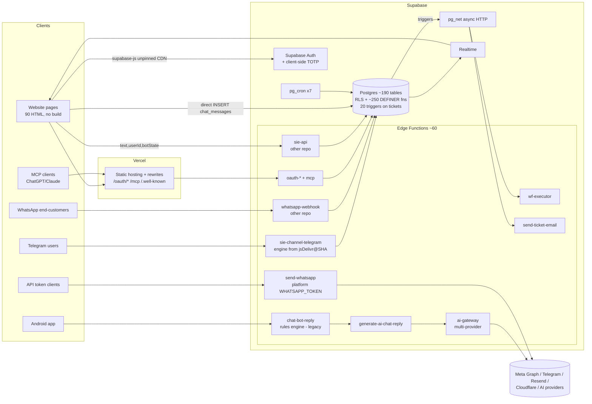

# MAD3OOM — مراجعة هندسية واستراتيجية شاملة (أكتوبر 2026)

> **النطاق:** المستودع `Mad3oom` كاملًا (frontend + 59 Edge Function + 66 migration + الاختبارات + CI)، وقاعدة الإنتاج `srnelrdpqkcntbgudyto` بقراءة فقط (Supabase advisors، تعريفات الدوال، السياسات، الفهارس، cron، أعداد الصفوف).
> **خارج النطاق (بطلبك):** تقييم الـ 9 Layers الداخلية لـ SIE — لها مهمة منفصلة. المذكور هنا عن SIE هو **حدود التكامل من جهة Mad3oom فقط**.
> **مستودعات لم أرها:** `sie` و`whatsapp-mad3oom` (فيهم `sie-api` و`whatsapp-webhook` و`register-whatsapp` و`integrations-api`). أي حكم عليهم هنا مكتوب صراحة إنه «غير متحقق».
>
> **طريقة الإثبات:** كل نتيجة معلّمة بمصدرها:
> `[كود]` قراءة مباشرة للمصدر · `[إنتاج]` استعلام قراءة على قاعدة الإنتاج · `[تجربة]` تشغيل فعلي للكود · `[استنتاج]` تحليل بلا دليل تشغيلي.

---

## 1. Executive Summary

**الحكم المختصر:** Mad3oom **مش منتج جاهز للإطلاق التجاري الواسع**، لكنه كمان **مش مشروع ضعيف**. هو مشروع فيه **قلب أمني وقاعدي (DB/RLS) متين بشكل غير معتاد لمشروع بالحجم ده**، محاط بـ**طبقة منتج مترامية جدًا** (feature sprawl) أكبر بكتير من الاستخدام الفعلي، و**فجوات تشغيلية (operability)** هتظهر أول ما يجي عملاء حقيقيين.

الأرقام اللي بتلخّص الوضع `[إنتاج]` `[كود]`:

| المؤشر | القيمة |
|---|---|
| جداول في `public` | **~190 جدول** |
| Edge Functions منشورة | ~60 (59 مجلد في الريبو + 5 مصدرها في ريبوهات تانية) |
| دوال قاعدة بيانات بلا مصدر في الريبو | **~180** (حسب `drift-baseline.json`) |
| سطور كود (js/ts/html/css) | **~146,000** سطر، 90 صفحة HTML |
| مستخدمين (`profiles`) | **32** |
| تذاكر | **36** |
| رسائل شات | **483** |
| اشتراكات | **11** |

يعني **سطح النظام أكبر من الاستخدام بحوالي مرتبتين عشريتين**. ده أهم قرار استراتيجي لازم يتاخد: مش «إيه الـ Feature الجاية»، لكن «إيه اللي هنقفله ونجمّده عشان نقدر نشغّل الباقي باحتراف».

**أخطر 5 حاجات حاليًا:**
1. **الـ 2FA بيتطبق في المتصفح بس** — كلمة السر لوحدها بتدي session كامل صالح لكل RLS قبل خطوة الرمز. `[كود]`
2. **الـ schema الأساسي مش في الريبو** (profiles, tickets, chat_*, messages, integrations, notifications, bot_settings…) + ~180 دالة بلا مصدر → مفيش طريقة تبني قاعدة من الصفر، ومفيش staging حقيقي، والاختبارات SQL بتشتغل على fixtures منسوخة باليد. `[كود]` `[إنتاج]`
3. **كل التينانتس بيبعتوا واتساب بتوكن Meta واحد بتاع المنصة** (`WHATSAPP_TOKEN`) — مخاطرة على حساب الـ WABA بتاعك كله بسبب عميل واحد. `[كود]`
4. **الـ billing بتاع رسائل واتساب fail-open في كل نقطة** — فشل فحص الرصيد = اسمح، فشل الخصم = الرسالة اتبعتت ببلاش، فشل فحص التكرار = تخطّى الخصم. `[كود]`
5. **محرك الشات اللي في الريبو (`chat-bot-reply`) بيفهم غلط بشكل منهجي** — جرّبته فعليًا: «طريقة اشتراك الواتساب؟» و«طريقة أعرف سعر اشتراك الواتساب؟» **الاتنين** بيتصنفوا «حالة اشتراكي»، و«التطبيق مش عايز يفتح» بيتصنف **إلغاء**، و«الاشتراك اتخصم مرتين» بيرد بـ**عروض الخصم**. والأسعار اللي بيقولها **بالدولار وقديمة** بينما الخطط الحالية بالجنيه. `[تجربة]`

**أقوى 5 حاجات:**
1. هندسة الـ RLS/SECURITY DEFINER في الـ migrations الأخيرة (024→066): حراس أعمدة، `with check`، advisory locks على الحصص، اختبارات تزامن حقيقية بـ `dblink`.
2. **Conversation Core (064)**: تصميم ذرّي ممتاز (ingest idempotent، optimistic concurrency بـ `state_version`، delivery lease بـ attempt fencing). أحسن قطعة معمارية في المشروع — **لكنها مطفية** (الأعلام `false`، ومفيش مستهلك في الريبو).
3. ثقافة توثيق وأدلة: `_AUDIT_NOTES.md`، `_PRODUCTION_SNAPSHOTS.md`، drift detection يومي ضد الإنتاج. نادر جدًا.
4. Inbox/Handoff (055–060): ضمانات تسليم إنسان↔بوت مثبتة بالاختبار.
5. CI بيشغّل SQL tests على Postgres حقيقي وبيفشل لو اتخطّت.

---

## 2. Current Architecture

### 2.1 النظام مكوّن من إيه؟

| الطبقة | التقنية | ملاحظات |
|---|---|---|
| Frontend | HTML/CSS/Vanilla ES Modules، **بلا build step**، منشور على Vercel | 90 صفحة، ملفات JS لحد 2.5k سطر، supabase-js من CDN |
| Auth | Supabase Auth (password، Google، Pi Network، Telegram OTP) + TOTP مخصص | الـ 2FA مش Supabase MFA الأصلي |
| Data | Supabase Postgres + RLS + ~250 دالة SECURITY DEFINER قابلة للنداء من `authenticated` | |
| Backend logic | 3 أماكن: **(1)** Edge Functions (Deno) **(2)** Triggers/RPC في Postgres **(3)** منطق في المتصفح | |
| Async | `pg_net` من triggers + `pg_cron` (7 jobs) | مفيش queue حقيقي |
| AI | `ai-gateway` (multi-provider registry) ← `generate-ai-chat-reply` ← `chat-bot-reply` | |
| SIE | ريبو منفصل؛ `sie-api` (Edge Function من ريبو تاني) + `sie-channel-telegram` بيستورد المحرك من jsDelivr مثبت على commit | |
| WhatsApp | `send-whatsapp` (API tokens)، `whatsapp-graph-request`، `meta-webhook` (templates)، `whatsapp-webhook` (inbound — ريبو تاني) | |
| Integrations | MCP server + OAuth 2.1 server كامل (DCR, PKCE)، MCP client، external integrations، accounting sync | |
| منتجات تانية في نفس القاعدة | `emp_ops` (متابعة موظفين، cron كل دقيقة)، `aqar_*`، Pi auth، forum، rewards/badges، blog، community | **blast radius مشترك** |

### 2.2 كل module مسؤول عن إيه (الأساسي)

- **Tickets:** جدول `tickets` + **20 trigger** (ترقيم، SLA، quota، round-robin، 4 أنواع إشعارات، email، webhooks، workflows، audit، guards).
- **Live chat (Website):** `chat_sessions`/`chat_messages`، المتصفح بيكتب رسالة العميل مباشرة، وبعدين بينادي `sie-api`، والبوت بيكتب رده من السيرفر (062). Realtime للعرض.
- **Inbox (Admin):** `inbox_*` (055–060) — assignment, tags, notes, scheduled replies (cron كل دقيقة)، handoff إنسان↔بوت.
- **WhatsApp:** `integrations` + `messages` + محافظ (`whatsapp_wallets`, `wa_wallet_*`) + campaigns.
- **Subscriptions/Plans:** `subscription_plans` + `whatsapp_subscriptions` (اسمه غلط: فيه كل الخطط) + `plan_ticket_quotas` + `enforce_ticket_quota`.
- **Authority model:** `profiles.role` + `platform_authority` (elevated_admin) + `owner_capability()` + `super_user_id` (supervises) + company roles (035).
- **Automation:** builder في `/automation` + `wf_*` + `wf-executor` (Edge) يتنده من trigger على إنشاء التذكرة.
- **Knowledge Base:** `knowledge_base` + help center (013) + `chat_engine_knowledge_entries` (SIE).

### 2.3 البيانات بتمشي إزاي؟ (رحلة رسالة على الموقع)

```
المتصفح (chat-logic.js / chat-widget.js)
  ├─(1) INSERT chat_messages  ← كتابة مباشرة من المتصفح (RLS)
  │      └─ triggers: conv_assign_seq (قفل صف الجلسة + max(seq)) → inbox_events → handle_new_chat_message → notify_admin_on_new_chat
  ├─(2) SELECT chat_sessions.bot_state, is_manual_mode
  ├─(3) POST sie-api /api/v1/chat/reply  {text, sessionId, userId, botState}   ← نص منفصل عن اللي اتخزن في (1)
  │      └─ sie-api يكتب رد البوت + bot_state + تذكرة (persist_bot_turn) — [غير متحقق: ريبو تاني]
  └─(4) Realtime يعرض الرد
       لو فشل: RPC chat_post_notice (السيرفر يكتب نص الخطأ)
```

### 2.4 فين بتتاخد القرارات وفين الـ business rules؟

**متوزعة على 4 أماكن، وده أكبر مصدر للـ bugs المستقبلية:**
1. **Postgres triggers/RPC** — الحصص، الحراس، الترقيات، الـ handoff (الأقوى والأصح).
2. **Edge Functions** — billing الواتساب، rate limits، AI quota (fail-open).
3. **المتصفح** — قرار «هل أنده SIE ولا أعرض رسالة منع»، ترتيب الرسائل، 2FA.
4. **نصوص hardcoded** — الأسعار في `chat-bot-reply` (USD) مقابل `subscription_plans` (EGP).

### 2.5 نقاط الاختناق

- **جدول `tickets`**: 20 trigger، كل insert = ~3×عدد الأدمنز صفوف إشعارات + HTTP enqueue × (email + webhooks + workflows) + advisory lock للحصة.
- **صف `chat_sessions`**: كل رسالة بتاخد `FOR NO KEY UPDATE` عليه (seq).
- **سلسلة Edge→Edge→Edge**: `chat-bot-reply → generate-ai-chat-reply → ai-gateway`، كل واحدة بتعمل `auth.getUser()` (رحلة شبكة) — latency تراكمية وcold starts مضروبة.
- **بوت واحد عالمي**: `bot_settings` و`ticket_distribution_config` و`webhooks` و`wf_workflows` كلهم **إعدادات منصة واحدة** مش لكل tenant.

### 2.6 Coupling قوي

- `profiles` هو God table: role, email, phone, 2FA flags, points, ban, whatsapp_enabled, pi_uid, telegram_chat_id, aqar_enabled, super_user_id, user_type… (9 فهارس).
- `whatsapp_subscriptions` بقى جدول كل الخطط → أي تعديل خطط بيلمس منطق الواتساب.
- `mcp-arch` منسوخ في **3 أماكن** (`/mcp`، `mcp-invoke-tool/_shared`، `test-mcp-server/_shared`) و`whatsapp-billing.ts` منسوخ في `send-whatsapp` و`mcp`.

### 2.7 Redundant / Obsolete

- `chat-bot-reply` (محرك قواعد قديم) **بالتوازي مع** SIE، والموقع مابقاش بيستخدمه (بيستخدمه Android حسب التعليقات).
- `inbound-email-webhook` و`resend-inbound-webhook` نفس الوظيفة (الثاني هو الحي).
- `ai-probe-temp` (410 دايمًا)، `huggingface-chatbot` لسه مجلده موجود، `_pre_038_rollback` جدول باقي في الإنتاج.
- 4 triggers إشعار على إنشاء التذكرة بيكرروا بعض (تفصيل في §6).
- `trg_enforce_customer_ticket_update` و`trg_restrict_customer_ticket_update` — حارسين لنفس الغرض.
- ~20 ملف Markdown في الجذر (`FULL_PROJECT_AUDIT.md` 119KB، `CODE_REVIEW_ANALYSIS.md`، `REFACTORING_*`، `todo.md` عن ملفات مش موجودة زي `sign-up-new.html`).

### 2.8 Critical infrastructure

`profiles` + `is_admin()/has_elevated_authority()/owner_capability()` · `account_is_active()` (RESTRICTIVE gate) · `tickets` triggers · `chat_messages` triggers · `api_tokens` + `create-api-token` · OAuth server (`oauth-*`) · `send-whatsapp` + wallet RPCs · `internal_service_secrets` (أسرار الـ triggers) · Vercel rewrites لـ `/oauth/*` و`/mcp`.

---

## 3. Architecture Diagram



---

## 4. Module-by-Module Audit

| Module | الحالة | أهم مشكلة | التقييم |
|---|---|---|---|
| **Auth** | يعمل، متعدد المسارات | 2FA في المتصفح فقط (§5-S1)؛ 4 طرق دخول (password/Google/Pi/Telegram) = سطح كبير | 5/10 |
| **Authorization/RLS** | قوي في الجداول الجديدة | منطق الأدوار متفرق (`role='support'` في سياسات التذاكر بينما `is_support_user()` مايشملوش)، سياسات قديمة بـ subquery لكل صف | 7/10 |
| **Tickets** | يعمل | 20 trigger، إشعارات مكررة، لا فهرس على `user_id/status/created_at` | 5/10 |
| **Live chat (web)** | يعمل عبر SIE | كتابة رسالة العميل من المتصفح منفصلة عن طلب الرد؛ مفيش idempotency key للإرسال | 6/10 |
| **chat-bot-reply** | منشور، legacy | فهم خاطئ منهجي + أسعار قديمة + `bot_settings.single()` بيفشل دايمًا (§9) | **2/10** |
| **Inbox/Handoff** | ممتاز DB-wise | الـ UI ملف 1858 سطر | 8/10 |
| **Conversation Core** | مصمم ممتاز، **مطفي** | مفيش consumer؛ قيمة صفر لحد ما يتفعل | تصميم 9/10 · أثر 0 |
| **WhatsApp send** | يعمل | توكن منصة مشترك + billing fail-open + rate limit fail-open | 4/10 |
| **WhatsApp inbound** | غير متحقق (ريبو تاني) | 063 أضاف idempotency على `(user_id, wa_message_id)` — جيد | — |
| **Telegram (SIE channel)** | يعمل | dedupe في الذاكرة لكل isolate فقط؛ أي exception → 200 (رسالة ضايعة بصمت) | 6/10 |
| **Knowledge Base** | 3 مصادر معرفة مختلفة | `knowledge_base` و help center و`chat_engine_knowledge_entries` — مش موحدين، والـ AI fallback مش بيستخدم أي منهم | 4/10 |
| **Automation (wf)** | يعمل | منصة واحدة (مش per-tenant)، هوية أدمن hardcoded (`SYSTEM_FALLBACK_USER_ID`) | 5/10 |
| **AI gateway** | تصميم جيد (registry/routing/usage) | مفيش grounding، temperature 0.7، quota fail-open | 6/10 |
| **Admin** | 30 صفحة | كتير جدًا لـ 32 مستخدم؛ صفحات ملفات 1.4k–2.4k سطر | 5/10 |
| **Subscriptions/Billing** | DB قوي (017–023, 065) | يدوي (طلب → موافقة أدمن)، مفيش payment gateway؛ أسماء جداول مضللة | 6/10 |
| **Notifications** | يعمل | fan-out لكل أدمن × 3 triggers | 5/10 |
| **MCP + OAuth server** | محترم تقنيًا (PKCE, rotation, DCR rate-limit) | issuer لسه `.online` في الإنتاج؛ كل POST في السلسلة كان بيموت بسبب 301 (موثق عندك) | 6/10 |
| **Forum/Rewards/Badges/Community/Blog/Pi/Aqar/emp_ops** | موجودين | **مش جزء من قيمة منتج دعم العملاء** | انظر §21 |
| **Observability** | `site_errors` + console logs | لا correlation IDs، لا metrics، لا alerting | 3/10 |
| **Testing** | 829 node test + 38 SQL suite | قوي للـ DB، **صفر** اختبارات تشغيل للـ Edge Functions | 6/10 |
| **Deployment** | يدوي (Dashboard/MCP) + drift check | المصدر ≠ المنشور تاريخيًا؛ 065 اتطبق على 5 دفعات مختلفة عن الملف | 4/10 |

---

## 5. Security Audit

> ملاحظة إنصاف: كتير من الثغرات الكبيرة القديمة (gemini-proxy cross-tenant، check-dns-status بدون auth، verify-2fa بسر من الـ caller، plaintext Meta token fallback، 2FA disable عبر PATCH) **اتقفلت فعلًا** في 006/027–049. القائمة دي هي اللي **لسه مفتوحة**.

### S1 — 2FA قابل للتخطي بالكامل · **High**
- **المكان:** `login.html:1608–1676`، `auth-client.js:207–300`.
- **السيناريو:** المهاجم معاه كلمة السر (تسريب/phishing). ينادي `signInWithPassword` بنفسه (المفتاح العام موجود في `supabase-config.js`) → ياخد `access_token` صالح. شاشة الرمز مجرد UI بعد ما الـ session اتعمل. مفيش سياسة RLS بتفحص `aal`، و`account_is_active()` مابيبصش على 2FA.
- **الأثر:** كل ما يقدر صاحب الحساب يعمله عبر REST (قراءة تذاكر/رسائل، تعديل بيانات، إصدار API tokens لو مسموح). الـ step-up في 053 بيحمي عمليات المالك فقط.
- **الإصلاح:** الانتقال لـ Supabase MFA الأصلي (`auth.mfa.challenge/verify`) واللي بيرفع الـ JWT لـ `aal2`، وإضافة سياسة RESTRICTIVE على الجداول الحساسة: `(select auth.jwt()->>'aal') = 'aal2' or not public.user_has_mfa(auth.uid())`. البديل: Edge Function واحدة تاخد password+TOTP ولا تصدر session إلا بعد الاتنين.

### S2 — حرمان الكل من الدخول بالـ username/phone عبر bucket عالمي · **Medium**
- **المكان:** `get_email_by_username`, `get_email_by_phone`, `resolve_company_member_login` (قابلة للنداء من `anon`) `[إنتاج]`.
- **السيناريو:** الدوال فيها حد per-key (5/10 دقائق) **وحد عالمي** `('global', 60, 300)`. أي زائر مجهول يبعت 60 طلب كل 5 دقائق بأسماء عشوائية → كل مستخدمي المنصة مايقدروش يدخلوا بالـ username/الهاتف. وفي نفس الوقت: enumeration للإيميلات من usernames (اللي ظاهرة في الـ forum).
- **الإصلاح:** إلغاء الإرجاع للمتصفح أصلًا: Edge Function `login-by-identifier` تاخد identifier+password+Turnstile وتعمل sign-in من السيرفر. الحد يبقى per-IP + Turnstile، مش عالمي.

### S3 — Webhook البريد الوارد: fail-open + replay · **Medium**
- **المكان:** `resend-inbound-webhook/index.ts:58` و`:42` (ونفس الشيء في `inbound-email-webhook`).
- **المشكلة:** (أ) لو `RESEND_WEBHOOK_SECRET` مش مضبوط → يقبل أي POST. (ب) مفيش فحص لـ `svix-timestamp` (نافذة 5 دقائق) → أي payload موقّع اتسرّب يتعاد للأبد. (ج) مفيش dedupe على `svix-id`. (د) مقارنة غير ثابتة الزمن.
- **الأثر:** حقن رسائل مزيفة في mailbox الأدمن منسوبة لأي عميل بالإيميل.
- **الإصلاح:** fail-closed، tolerance 300s، جدول `webhook_receipts(provider, event_id unique)`.

### S4 — توكن Meta مشترك لكل التينانتس · **High (business/security)**
- **المكان:** `send-whatsapp/_shared/whatsapp-service.ts:34–37` (`TODO: return integration.access_token`).
- **الأثر:** أي tenant يبعت spam → تقييم جودة/حظر **حساب المنصة نفسه** → كل العملاء يقعوا. مفيش عزل على مستوى Meta. وكمان معناها إن توكن المنصة لازم يكون له صلاحية على WABAs العملاء — صلاحية أوسع من اللازم.
- **الإصلاح:** استخدام توكن كل tenant المشفّر (موجود أصلًا ومستخدم في `whatsapp-graph-request`)، أو Embedded Signup بـ System User لكل عميل.

### S5 — أسرار مخزنة كنص · **Medium**
- `customer_telegram_bots.bot_token` plaintext `[كود: telegram-connect-bot]`.
- `integrations.access_token` (legacy plaintext) — كانت 2 من 3 صفوف وقت التدقيق السابق.
- `internal_service_secrets` / `channel_secrets` في جداول عادية (RLS deny-all — مقبول، لكن Supabase Vault أصح).
- `wa_set_integration_billing_method` بترجع `integrations` **كاملًا** (بالتوكن) للمتصل.
- **الإصلاح:** تشفير بنفس نمط AES-GCM الموجود، nulling للعمود القديم، Vault للأسرار الداخلية، وعدم إرجاع صفوف فيها أسرار.

### S6 — مفيش CSP + 813 `innerHTML` + سكربتات CDN بلا SRI + supabase-js غير مثبت · **Medium**
- `api-config.js:1`: `import ... from 'https://cdn.jsdelivr.net/npm/@supabase/supabase-js/+esm'` **بدون رقم إصدار** → أول إصدار major جديد ممكن يكسر **كل المنصة في نفس اللحظة**، وأي اختراق لـ jsDelivr = تنفيذ كود على كل صفحة فيها session.
- 0 صفحات فيها `Content-Security-Policy`، و`vercel.json` مافيهوش headers.
- 813 تعيين `innerHTML` بيعتمد على escape يدوي — الكود الحالي اللي شوفته بيعمل escape صح، لكن ده نمط بيكسر مع أول مطوّر مستعجل.
- `xlsx@0.18.5` (npm + CDN) عليه CVEs معروفة (prototype pollution / ReDoS عند قراءة ملفات) — الخطر محدود لو بيُستخدم للتصدير فقط.
- **الإصلاح:** pin لكل CDN بإصدار + SRI، CSP صارم عبر `vercel.json` headers، `X-Frame-Options/frame-ancestors`، وتدريجيًا build step بيجمع الاعتماديات محليًا.

### S7 — SSRF محدود · **Low**
- `test-integration-connection` بيبعت POST لأي URL خزّنه المالك. `dispatch_ticket_webhooks` بيبعت من داخل قاعدة البيانات (`pg_net`) لأي URL يحدده أدمن. حاليًا admin/owner-only، لكن لو اتفتحت webhooks للتينانتس لازم allowlist ومنع IPs داخلية.

### S8 — نسب الأفعال الآلية لأدمن حقيقي · **Low (audit integrity)**
- `wf-executor/index.ts:21`: `SYSTEM_FALLBACK_USER_ID` = حساب `info@` الأدمن. كل تشغيل آلي بيظهر في الـ audit كأن الأدمن عمله. **الإصلاح:** مستخدم نظام مخصص أو `actor_type='system'`.

### S9 — Service role كبوابة عامة · **Low-Medium**
- `chat-bot-reply` بيتحقق من ملكية الجلسة مرة واحدة، وبعدها كل الكتابات بالـ service role (تذاكر، رسائل، bot_state). صحيح حاليًا، لكن أي إضافة مستقبلية في الدالة بتكون خارج RLS افتراضيًا. نفس النمط في ~20 دالة.
- رسائل الخطأ بترجع `err.message` للعميل (`chat-bot-reply:775`).

### S10 — مخرجات Supabase advisors · **Info/Low** `[إنتاج]`
- Leaked password protection **مقفول**.
- 12 دالة `search_path` قابل للتغيير (معظمها SIE/owner-context).
- `pg_net`, `http`, `btree_gist` في `public`.
- 249 دالة SECURITY DEFINER قابلة للنداء من `authenticated`، و61 من `anon` (أغلبها trigger functions ومش قابلة للنداء عمليًا عبر PostgREST، لكن الـ RPCs الحقيقية منها: email lookups، `increment_blog_view`، `increment_thread_views` — آخر اتنين = تضخيم عدادات مجهول).

### S11 — منتجات متعددة في نفس المشروع · **Medium (strategic security)**
- `emp_ops` (متابعة موظفين: attendance, devices, activity — بيانات PII حساسة جدًا) و`aqar` وPi وforum كلهم في نفس قاعدة Mad3oom ونفس الـ service role. أي ثغرة في أي منتج = وصول لبيانات كل المنتجات. وحدود الـ Supabase plan (connections/compute) مشتركة.

### S12 — ما اتأكدتش منه (لازم يتراجع في الريبوهات التانية)
- `sie-api`: هل بيتجاهل `userId` من الـ body ويعتمد على الـ JWT؟ هل بيتحقق إن `sessionId` ملك المستخدم؟ هل الـ `text` بيطابق آخر رسالة اتخزنت؟ (المتصفح بيبعتهم منفصلين).
- `whatsapp-webhook`: التحقق من `X-Hub-Signature-256` fail-closed؟

---

## 6. Database Audit

### 6.1 أكبر مشكلة: الـ schema مش تحت version control
- الـ migrations تبدأ من `001_create_status_tables` — **مفيش** DDL لـ `profiles`, `tickets`, `chat_sessions`, `chat_messages`, `messages`, `integrations`, `notifications`, `bot_settings`, `whatsapp_subscriptions`… `[كود]`.
- `drift-baseline.json` بيعدّ ~180 دالة حية بلا مصدر.
- اختبارات SQL بتبني **نسخة يدوية** من شكل الإنتاج (`CREATE TABLE public.profiles (...)` جوه كل ملف اختبار) → لو الإنتاج اتغير، الاختبارات تفضل خضرا وهي بتختبر عالم مش موجود. **ده false confidence هيكلي.**
- ترقيم: `043_api_token_mutation_guard.sql` و`043_blog.sql` بنفس الرقم؛ 026 و051 ناقصين؛ 065 «طُبّق على خمس دفعات 065a..065e بلا drop if exists» — يعني الملف ≠ ما طُبّق.
- rollback موجود لـ 059–064 بس.

**الإصلاح (P0):** `supabase db dump --schema public` → `migrations/000_baseline.sql`، واعتماد Supabase CLI migrations كمصدر الحقيقة الوحيد، ومنع أي DDL من الـ Dashboard، وتوليد fixtures الاختبار من الـ baseline بدل نسخها يدويًا.

### 6.2 جدول `tickets` `[إنتاج]`
- **20 trigger.** منها:
  - `notify_admin_on_new_ticket` + `notify_all_admins_on_ticket` + `trg_notify_urgent_ticket` → **كل أدمن بياخد 2–3 إشعارات لنفس التذكرة**.
  - `trg_enforce_customer_ticket_update` + `trg_restrict_customer_ticket_update` → حارسين متداخلين.
  - `dispatch_ticket_webhooks` بيسجّل `webhook_deliveries.success = true` **لحظة الإدراج في طابور pg_net** قبل ما يعرف النتيجة → سجل كاذب.
  - `assign_ticket_round_robin` بيقرأ `last_assigned_index` من غير `FOR UPDATE` → تذكرتين متزامنتين لنفس الموظف.
- **الفهارس:** `pkey` + `subdomain_id` بس. **مفيش** فهرس على `user_id` (وده عمود سياسة RLS الأساسية)، ولا `status`، ولا `assigned_to`، ولا `created_at`. الآن 36 صف = مش مشكلة؛ عند 1M صف كل صفحة عميل = seq scan.
- **سياسات مكررة:** `Customer can create ticket` و`Users can create tickets` (نفس الشرط). سياسات بـ `EXISTS (select from profiles where id = auth.uid())` بدل `(select public.is_admin())` المحسوبة مرة واحدة.

### 6.3 تكامل البيانات
- `bot_settings`: صف عالمي (`phone_number_id is null`) + صفوف per-tenant في نفس الجدول → أي `.single()` بالـ service role **بيفشل** (3 صفوف في الإنتاج) — §9.
- `whatsapp_subscriptions` فيه `support/ultimate/whatsapp/bundle` — الاسم مضلل ويخلي أي مطوّر جديد يغلط.
- `profiles`: فهرس مكرر على `pi_uid` (unique + btree عادي).
- `inbox_events` بيكبر بصف لكل رسالة (064) + أحداث الإدارة — محتاج سياسة retention/partitioning مبكرًا.
- `_pre_038_rollback` جدول بقايا في الإنتاج.
- 21 جدول RLS بلا سياسات = deny-all (صحيح للجداول الداخلية).

### 6.4 Concurrency — نقاط قوة حقيقية
- `enforce_ticket_quota` بـ advisory lock على الحساب ✔️
- `conv_ingest_message` بـ advisory lock + unique indexes كشبكة أمان ✔️
- `conv_commit_turn` optimistic concurrency ✔️
- `063` idempotency للواتساب الوارد ✔️
- **ضعف:** round-robin، billing الواتساب (check ثم charge بدون حجز → رصيد سالب مع إرسال متزامن)، `chat-bot-reply` بيقرأ `bot_state` ويكتبه بدون version → رسالتين متزامنتين = lost update.

### 6.5 Cron `[إنتاج]`
`sla-breach-check` (15د)، `data-retention-cleanup` (يومي)، `expire-stale-subscriptions-hourly`، `oauth-cleanup-daily`، `inbox-dispatch-scheduled` (كل دقيقة)، و**`emp_ops_maintenance_tick` كل دقيقة + `emp_ops_daily_rollup` كل 15د** — منتج تاني بيستهلك موارد قاعدة Mad3oom.

---

## 7. Performance Audit

> الحجم الحالي صغير جدًا، فـ**مفيش بطء حقيقي في الداتابيز النهارده**. البطء الفعلي في **الواجهة** وفي **سلاسل الـ Edge**.

| المشكلة | الدليل | الأولوية |
|---|---|---|
| لا build/minify/bundle؛ ES modules بتعمل waterfall | 90 صفحة، `customer-dashboard.js` 123KB، `chat-widget.js` 100KB | P1 |
| HTML ضخم inline | `api-docs.html` 250KB، `knowledgebase.html` 188KB، `index.html` 120KB، `login.html` 97KB | P1 |
| صور غير مضغوطة | `/logo.png` **1MB** (مستخدم في عشرات الصفحات)، `mad3oom-robot.png` 265KB | P1 (أسهل مكسب) |
| supabase-js بيتحمل من CDN في كل صفحة، بصيغ مختلفة (umd/esm/@2/unpinned) | `api-config.js` + 6 صفحات | P1 |
| سلسلة Edge متتالية | `chat-bot-reply → generate-ai-chat-reply → ai-gateway` (3 cold starts + 3 `getUser`) | P2 |
| `sie-channel-telegram` بيحمّل ~1MB من jsDelivr في كل cold start | تعليق الملف نفسه | P2 |
| fan-out على كل تذكرة | 20 trigger | P2 |
| RLS بـ subquery لكل صف + غياب فهارس `user_id` | §6.2 | P1 قبل 1k عميل |
| `send-whatsapp` rate limit بـ `count(*)` على `api_token_usage_logs` (4.3k صف ويزيد) | `api-auth.ts:80` | P2 |

**ترتيب الإصلاح:** (1) ضغط الصور + pin/self-host supabase-js (يوم واحد، أثر فوري). (2) فهارس tickets/الـ RLS wrapping. (3) build step خفيف (Vite/esbuild) بدون إعادة كتابة. (4) دمج سلسلة الـ AI في دالة واحدة.

---

## 8. SIE — حدود التكامل فقط (التقييم الداخلي في مهمة منفصلة بطلبك)

ملاحظات من جهة Mad3oom تستاهل تتنقل للمهمة التانية:
1. **مصدر `sie-api` مش في أي مكان من الريبو ده**، والموقع كله بيعتمد عليه.
2. `sie-config.js` كان مضبوط على دومين بيرجّع 404 — يعني **وضع SIE على الموقع ماكانش شغال خالص لفترة** (موثّق في الملف نفسه). ده مثال على silent failure مايتكشفش من غير synthetic monitoring.
3. الـ circuit breaker في `sie-client.js` per-tab (متغير في الذاكرة) — ده مقبول.
4. رسالة العميل بتتكتب من المتصفح، والنص بيتبعت لـ SIE في طلب منفصل → السيرفر لازم ياخد النص من الصف المخزّن (بـ message id) مش من الـ body.
5. Telegram: `createMemoryDeduplicator()` = dedupe جوه isolate واحد بس؛ وأي exception بيرجع 200 (عن قصد لمنع الـ retry) → الرسالة **بتضيع بصمت** من غير dead-letter.
6. Conversation Core (064) جاهز للـ SIE بالظبط (ingest/commit/delivery) — **تفعيله هو أكبر رافعة reliability متاحة**.

---

## 9. Chat Engine Audit (`chat-bot-reply` — المحرك الموجود في الريبو)

> المحرك ده **منشور** (v14) وبيخدم Android حسب تعليقاته. الموقع اتنقل لـ SIE. لو Android لسه بيستخدمه، فكل اللي تحت ده بيحصل لعملاء حقيقيين.

### 9.1 رحلة الرسالة
`normalizeArabic` → **cancel patterns أولًا** → قوائم keywords بالترتيب → flow state machine (`bot_state.flow`) → `detectKnownTopic` (tickets/subscription/info/pricing) → greeting/thanks → AI fallback → «مش متأكد إني فهمتك».

- **Intent understanding:** substring + Levenshtein fuzzy. **مفيش** scoring، مفيش ترتيب بالأقوى، أول match يكسب.
- **Context:** `bot_state.flow` فقط. مفيش ذاكرة سؤال سابق.
- **Confidence:** غير موجود.
- **Escalation:** إنشاء تذكرة بعد جمع بيانات. مفيش handoff لإنسان.
- **Fallback:** رسالة عامة + القائمة (آمن نسبيًا).
- **Deterministic guarantees:** حتمي، لكن **حتمي في الغلط**.

### 9.2 تجربة فعلية `[تجربة]` (شغّلت دوال المطابقة نفسها من الملف)

| رسالة العميل | النية الحقيقية | ما يحدث فعليًا |
|---|---|---|
| طريقة اشتراك الواتساب؟ | how-to subscribe | **SUB_STATUS** → يعرض «دي بيانات اشتراكك» |
| طريقة أعرف سعر اشتراك الواتساب؟ | pricing | **SUB_STATUS** → نفس الرد بالظبط |
| عايز اشترك في الواتساب | purchase intent | **SUB_STATUS** |
| التطبيق مش عايز يفتح | problem report | **CANCEL** (لو العميل في نص وصف مشكلة، المسودة بتتمسح) |
| عايز الغي الاشتراك | cancellation | **قائمة الأسعار** |
| الاشتراك اتخصم مرتين | billing complaint | **«عروض الإطلاق الحالية»** (لأن «خصم» substring من «اتخصم») |
| عندي مشكلة في تذكرة رقم 1052 | ticket problem | PROBLEM + INQUIRY + DISCOUNT كلهم بيطابقوا؛ والأرقام `1` و`2` patterns لوحدها فأي رقم فيه 1 أو 2 بيحوّل القائمة |

**السبب الجذري:**
1. `"اشتراكي"` كـ pattern من كلمة واحدة ≥4 حروف → fuzzy بـ threshold 2 → بيطابق «اشتراك».
2. `matchesPattern` بيعمل `normalizedText.includes(pattern)` → «خصم» جوه «اتخصم»، «مش عايز» جوه «مش عايز يفتح».
3. الترتيب: CANCEL قبل أي حاجة، و SUB_STATUS قبل PRICING، بدون أي تمييز بين «سؤال عن» و«حالتي».
4. مفيش مفهوم **slot/aspect** (subject=whatsapp، aspect=price|how-to|status|cancel).

### 9.3 Silent failures مؤكدة
- `bot_settings` فيها 3 صفوف `[إنتاج]` و`chat-bot-reply` بيعمل `.select("*").single()` بالـ service role → **error دايمًا** → `botSettings = null` → رسائل الترحيب/التذاكر المخصصة متجاهلة، و**الـ AI fallback عمره ما بيشتغل** (`botSettings?.ai_enabled` = undefined). نفس `.single()` في `generate-ai-chat-reply` → 500 دايمًا.
- الأسعار في الكود: 15$/20$/30$ + «تذاكر غير محدودة» + `company.mad3oom.online`؛ والحقيقة (065): «المتقدمة» 999 ج.م، 300 تذكرة/شهر، `mad3oom.com`. **البوت بيقول للعميل أسعار ووعود غير صحيحة.**
- الـ AI history بيقرأ آخر 8 رسائل (اللي فيها رسالة العميل الحالية، لأنها اتخزنت قبل النداء) ثم يضيف نفس الرسالة تاني → الموديل بيشوف السؤال مرتين.

### 9.4 هل الـ architecture تقدر تفرّق «طريقة الاشتراك» عن «سعر الاشتراك»؟
**لأ، ومش هتقدر بزيادة keywords.** المطلوب تصميم بالشكل ده (deterministic أولًا):
```
normalize → extract {subject: whatsapp|tickets|plan…, aspect: price|how_to|status|cancel|complaint|refund, polarity/negation}
         → intent = (subject, aspect)  مع score لكل مرشح
         → لو أعلى score < threshold أو الفرق بين أول اتنين صغير → سؤال توضيحي (clarify) مش تخمين
         → الرد من مصدر بيانات حي (subscription_plans) مش نص ثابت
         → كل قرار يتسجل (intent, scores, rule_id, source) في trace
```
وده لازم يكون معه **golden test set** (مئات الجمل الحقيقية بالعامية مع النية المتوقعة) يشتغل في CI ويمنع الـ regression — نفس الأسلوب ينفع لـ SIE.

---

## 10. Testing Audit

**الصورة:** 829 اختبار node (790 نجحوا عندي، و37 فشلوا كلهم بسبب نسخة متصفح Playwright في بيئة التدقيق — مش bugs) + 38 ملف SQL على Postgres حقيقي (نجحت كلها عندي، exit 0).

| النوع | الحالة | الحكم |
|---|---|---|
| SQL/RLS | قوي، فيه تزامن حقيقي (dblink)، rollback، idempotency | **أقوى جزء** — بس على fixtures يدوية (§6.1) |
| Model/unit (frontend) | كتير ومنظم | جيد |
| Render (Playwright) | بـ supabase fakes | بيثبت إن الـ UI بتنادي الصح، مش إن الـ backend بيرد صح |
| Edge Functions | **static regex فقط** (`api-token-function-static`, `remediation-static`) | **صفر تنفيذ**. مفيش Deno test لأي دالة |
| E2E حقيقي | غير موجود | — |
| Migration tests | upgrade/re-run/rollback لبعض الملفات | جيد للجديد، لا شيء للقديم |
| Security | RLS boundaries ممتازة؛ مفيش اختبار لـ 2FA AAL، webhooks signature، billing | ناقص |
| Chat engine / NLU | **صفر** | أخطر فجوة: الأخطاء في §9 مكتشفة في دقيقتين |
| Integrations (Meta/Telegram/Resend/AI) | صفر contract tests | ناقص |
| Failure injection | صفر | ناقص |
| Mutation testing | صفر | — |

**الاختبارات بتثبت صحة الـ DB؛ ومش بتثبت صحة المنتج.** الـ static tests بتثبت إن نص معين موجود/مش موجود في الكود — مفيدة كـ guard ضد regressions أمنية معروفة، لكنها مش اختبار سلوك.

**الناقص بالترتيب:** golden set للشات · Deno tests لـ `send-whatsapp`/billing/`chat-bot-reply`/webhooks · اختبار 2FA على مستوى AAL · contract test لـ `sie-api` · smoke E2E على staging بعد كل deploy.

---

## 11. Reliability Audit

### «النظام شغال ظاهريًا وهو فاشل فعلًا» — أمثلة موجودة النهارده
1. `chat-bot-reply`/`generate-ai-chat-reply`: الـ AI fallback ميت بسبب `.single()` — مفيش error ظاهر.
2. `webhook_deliveries.success = true` قبل أي إرسال.
3. Billing واتساب: فشل الخصم = log وخلاص؛ الرسالة اتبعتت.
4. AI quota: أي خطأ = اسمح (fail-open).
5. Telegram webhook: أي exception = 200 = رسالة العميل ضاعت.
6. SIE على الموقع كان بيرجّع 404 لفترة والعميل بيشوف «مشكلة مؤقتة».
7. Triggers بتنده HTTP عبر `pg_net` وبتبلع الأخطاء بـ `RAISE LOG` — لو `send-ticket-email` واقف، مفيش حد هيعرف.
8. 065 مطبق بشكل مختلف عن الملف — الريبو بيقول حاجة والإنتاج حاجة.

### مفقود
- **Queue + DLQ**: كل الـ async = `pg_net` fire-and-forget. مفيش retry policy، مفيش dead-letter.
- **Idempotency على الإرسال من المتصفح**: `chat_messages` insert بدون client message id (064 فيه الحل ومطفي).
- **Circuit breakers على الخدمات الخارجية من السيرفر** (موجود في المتصفح لـ SIE بس).
- **Timeouts موحدة** (موجودة في أماكن، ناقصة في `callGateway`).
- **Backups/restore drills**: معتمدين على Supabase بالكامل، ومن غير baseline schema الـ restore لبيئة تانية صعب.
- **Single points of failure:** مشروع Supabase واحد لكل المنتجات، توكن Meta واحد، دومين OAuth issuer واحد، jsDelivr (supabase-js + محرك SIE).

---

## 12. Observability Audit

| العنصر | موجود؟ |
|---|---|
| Client error logging | `site_errors` (1470 صف) + `error-tracker.js` ✔️ (بس في نفس القاعدة) |
| Server logs | `console.*` في Edge، بعضها structured JSON (billing) |
| Correlation/Request ID عبر المتصفح→Edge→DB | ❌ |
| tenant_id/user_id في كل log | جزئي |
| Metrics (latency, error rate, queue depth) | ❌ |
| Alerting | ❌ (إلا `send_test_telegram_alert` كأداة يدوية) |
| Audit logs | ✔️ قوي (`privileged_audit`, `owner_context_audit`, `subscription_audit_log`, `inbox_events`, `ticket_activity`) |
| AI decision traces | `ai_usage_events` (تكلفة/توكنز) ✔️ — لكن مش ليه اختار الرد |
| Chat engine traces | `chat_engine_trace_events` (SIE) ✔️؛ `chat-bot-reply` ❌ |
| Webhook logs | `webhook_deliveries` (كاذب)، `oauth_client_registrations_log` ✔️ |
| Synthetic monitoring | ❌ (ده كان هيكشف 404 بتاع SIE من أول يوم) |

**أهم 3 إضافات:** (1) `x-request-id` يتولد في المتصفح ويتمرر لكل Edge ويتكتب في كل صف/لوج. (2) Sentry (أو مكافئ) للمتصفح والـ Edge بدل `site_errors`. (3) synthetic check كل 5 دقائق على: login، إرسال رسالة شات والرد، `send-whatsapp` sandbox، OAuth discovery.

---

## 13. AI Audit

- **الـ AI مستخدم صح في:** fallback للأسئلة الحرة، الـ gateway متعدد المزودين مع registry/routing/usage — تصميم يسمح بتغيير الموديل بدون إعادة بناء ✔️.
- **الـ AI مستخدم غلط/ناقص في:**
  - **مفيش grounding**: `generate-ai-chat-reply` بيبعت system prompt + آخر 8 رسائل. مفيش KB retrieval، مفيش بيانات خطط حقيقية → الموديل حر يخترع أسعار ومزايا. «لو مش متأكد انصح بتذكرة» في البرومبت ≠ ضمان.
  - temperature 0.7 لرد دعم فني = عالي.
  - مفيش confidence ولا citation ولا رفض منظم.
  - مفيش تسجيل «ليه الموديل قال كده» (prompt+context+sources) — مش ممكن تعمل audit لرد غلط.
- **حاجات المفروض تبقى deterministic مش AI:** الأسعار، حالة الاشتراك، حالة التذكرة، سياسات الاسترجاع، خطوات الاشتراك — كلها **lookups من بيانات** مش توليد.
- **حاجات محتاجة AI فعلًا:** فهم العامية الحرة → (subject, aspect) كـ classifier بـ structured output؛ تلخيص المحادثة للموظف عند الـ handoff؛ اقتراح رد للموظف (agent assist) مع مصادر.
- **Model fallback:** الـ gateway فيه routing rules — جيد، لكن مفيش اختبار إنه بيشتغل.
- **التكلفة:** حد الساعة 10 رسائل للمجاني، والباقي «بلا حدود ومش بنعدّه» للمستحقين → عميل مستحق واحد بسكربت ممكن يصرف ميزانية الـ AI. محتاج سقف per-tenant/يوم وتسعير يغطي التوكنز.

---

## 14. UX/UI Audit

> مبني على قراءة الكود والصفحات، مش جلسات مستخدمين.

- **Information architecture:** 30 صفحة أدمن + لوحة شركة + لوحة عميل + owner dashboard + automation + MCP hub + forum + rewards + community + roadmap + blog. **المستخدم الجديد مش هيعرف «المنتج» هو إيه.** الصفحة الرئيسية بتقول «نظام عربي يقلل ضغط فريق الدعم» (رسالة كويسة ومركّزة) والمنتج من جوه بيقول عشر حاجات.
- **Onboarding:** account gate (هاتف/waitlist) قبل أي قيمة. مفيش «أول 5 دقايق»: اربط قناة → استقبل أول رسالة → رد → أغلق تذكرة.
- **Chat workflow:** جيد (مرفقات، صوت، حالة الخطة، رسائل خطأ واضحة). مشكلة: القائمة الثابتة «استفسار/مشكلة» بتعامل كل حاجة كتذكرة.
- **Ticket workflow:** status values اتصلحت حديثًا (`in_progress`)؛ إشعارات مكررة للأدمن = ضوضاء.
- **Settings:** `admin/settings.js` 1437 سطر — علامة إن الإعدادات بقت مكب.
- **States:** في تحسن واضح (loading/empty/error في الصفحات الجديدة، `page-guard` بيعرض سبب المنع بدل redirect loop) ✔️.
- **RTL/عربي:** ممتاز كأولوية؛ كل الواجهات عربية أولًا ✔️. لكن **مفيش i18n حقيقي** (نصوص hardcoded في JS وSQL) → التوسع خارج العربي مكلف.
- **Accessibility:** فيه `modal-a11y.js` واهتمام بالـ Escape/focus في الصفحات الجديدة ✔️؛ القديم غالبًا لأ.
- **Design system:** `design-tokens.css`, `color-system.css`, `styles.css`, `admin-style.css`, `chat-widget.css` 42KB, `forum-styles.css`… أكثر من نظام تصميم موازي. inline styles كتير جوه JS.
- **Mobile:** `RESPONSIVE_GUIDE_AR.md` موجود؛ الصفحات الضخمة (100KB+) هتبقى بطيئة على 3G.

---

## 15. Product Audit

**هل المنتج بيحل مشكلة واضحة؟** المشكلة واضحة وحقيقية: «شركات عربية صغيرة/متوسطة غرقانة في رسائل واتساب ومحتاجة تذاكر + رد آلي بالعامية». ده سوق حقيقي ومفيهوش منافسة عربية قوية بجودة عالية.

**هل الـ value proposition واضحة؟** على الصفحة الرئيسية: أيوه. جوه المنتج: لأ.

**هل قابل للبيع الآن؟** لعدد محدود من العملاء بدعم يدوي منك شخصيًا: أيوه. كـ self-serve SaaS: لأ، للأسباب دي:
1. الدفع يدوي (طلب → موافقة أدمن).
2. الواتساب على توكن المنصة (مش self-serve ومش آمن للتوسع).
3. البوت/AI مش per-tenant: `bot_settings` عالمي، الـ KB عالمي، الـ workflows عالمية. **يعني العميل (الشركة) مش قادر يبني بوت لعملاؤه هو** — وده المفروض يكون قلب المنتج.
4. مفيش onboarding موجّه.

**Features بقيمة غير واضحة (لـ منتج دعم عملاء):** Forum، Community، Rewards/Points/Badges، Pi Network login، Aqar، emp_ops، Ads ticker، Roadmap page، subdomain white-label (مكلّف تشغيليًا: Cloudflare + Vercel لكل عميل).

**Feature gaps حقيقية مقارنة بـ Intercom/Freshdesk/Respond.io/Zoko:**
- Inbox موحد **per-tenant** لكل القنوات (واتساب + ويب + تيليجرام + إيميل) — جزئيًا موجود للمنصة نفسها.
- بوت/KB **per-tenant** يدرّبه العميل.
- SLA وتقارير per-tenant.
- Payment gateway (Paymob/Fawry/Stripe) + فواتير تلقائية.
- Canned responses + macros (موجود جدول `canned_responses`).
- CSAT بعد الإغلاق (موجود rating جزئيًا).

**اللي بيمنع Mad3oom من إنه يبقى SaaS احترافي:** مش نقص features — **نقص تركيز + نقص multi-tenancy في الطبقة اللي العميل بيدفع عشانها (البوت والـ inbox) + operability.**

---

## 16. Scalability Analysis

| الحجم | اللي هيقع أولًا |
|---|---|
| **100 عميل** | (1) توكن Meta المشترك: عميل واحد بيعمل spam → حظر/تقييد كل المنصة. (2) الدعم اليدوي للاشتراكات والدفع. (3) إشعارات مكررة للأدمن (ضوضاء). (4) البوت العالمي مش مناسب لعملاء مختلفين. |
| **1,000 عميل** | (1) RLS بدون فهارس `user_id` على `tickets` + سياسات subquery → صفحات العميل/الأدمن تبطأ. (2) `pg_net` fire-and-forget بدون retry → إيميلات/workflows ضايعة يوميًا بدون علم. (3) cron كل دقيقة (inbox + emp_ops) + Realtime connections على نفس compute. (4) تكلفة AI بدون سقف للمستحقين. (5) Edge cold starts في سلسلة الـ 3 دوال. |
| **10,000 عميل** | (1) `chat_messages`/`messages`/`inbox_events`/`notifications` بالملايين بدون partitioning. (2) Realtime: حدود اتصالات Supabase. (3) Webhooks الواتساب الواردة burst → Edge concurrency + كتابة متزامنة. (4) Rate limiting بـ `count(*)` على جداول لوج. (5) المنتجات التانية في نفس المشروع بتنافس على connections. |
| **100,000 عميل** | المعمارية الحالية (كل منطق في triggers + Edge بدون queue + DB واحدة لكل المنتجات) **مش هتوصل**. محتاج: queue حقيقي (pgmq/SQS)، workers، فصل الـ messaging pipeline، partitioning بالوقت، read replicas، وغالبًا فصل tenants كبار. |

**Bottleneck معماري مبكر:** كل side-effect بيتعمل **جوه transaction الـ insert** عبر triggers. ده بيخلي الكتابة أبطأ مع كل feature جديدة، وبيخلي الفشل صامت. التحويل لـ **outbox pattern** (trigger يكتب صف `outbox` بس، و worker بيعالج مع retry) هو التغيير اللي بيفتح كل المراحل اللي بعد كده.

---

## 17. Technical Debt (الحقيقي، مش الشكلي)

1. **Schema خارج version control** + ~180 دالة بلا مصدر. (أعلى دين)
2. **3 أماكن للـ business logic** (DB / Edge / متصفح) بدون قاعدة واضحة مين يملك إيه.
3. **Copy-paste بين Edge Functions** (`mcp-arch` ×3، billing ×2، `api-auth` ×2، `rate-limit` نسخ مختلفة بايتيًا).
4. **Monolith pages**: ملفات JS بين 1.4k و2.5k سطر، HTML لحد 250KB، بلا build.
5. **Magic values**: أسعار في الكود، UUID أدمن، project ref مكتوب في 4+ أماكن (`supabase-config.js`, `sie-config.js`, `vercel.json`, triggers SQL)، `mad3oom.online` في issuer الإنتاج.
6. **God table `profiles`.**
7. **Naming debt**: `whatsapp_subscriptions` لكل الخطط؛ `bot_settings` عالمي+per-tenant؛ 3 جداول معرفة.
8. **وثائق مكدسة**: ~20 ملف MD في الجذر بعضها متناقض/قديم؛ الحقيقة موزعة.
9. **Legacy مازال منشور**: `chat-bot-reply`, `inbound-email-webhook`, `ai-probe-temp`, gemini-proxy البديل.
10. **Feature flags كثيرة مطفية لشهور** (Core flags) = كود بيتصان من غير ما يدّي قيمة.

---

## 18. Critical Risks

| # | الخطر | الاحتمال | الأثر |
|---|---|---|---|
| R1 | حظر/تقييد WABA المنصة بسبب tenant | متوسط | **كارثي** (كل العملاء) |
| R2 | استيلاء على حساب بكلمة سر مسرّبة رغم 2FA | متوسط | عالي |
| R3 | خسارة القدرة على إعادة بناء القاعدة (حادثة/ترحيل مشروع) | منخفض | **كارثي** |
| R4 | supabase-js unpinned يكسر المنصة كلها في يوم إصدار major | متوسط | عالي |
| R5 | البوت يدّي أسعار/وعود غلط → نزاعات عملاء | **حاصل الآن** (Android/legacy) | متوسط |
| R6 | تسرب إيراد من billing fail-open | **حاصل محتمل الآن** | متوسط |
| R7 | ثغرة في منتج جانبي (emp_ops/aqar/forum) تكشف بيانات Mad3oom | منخفض-متوسط | عالي |
| R8 | فشل صامت في الإيميلات/الـ workflows/Telegram | عالي | متوسط |
| R9 | حمل صيانة 190 جدول/60 دالة على فريق صغير → بطء التطوير | **حاصل** | عالي |

---

## 19. Missing Capabilities

- Multi-tenant bot/KB/workflow configuration.
- Payment gateway + subscription lifecycle آلي (dunning، renewal، proration — الـ upgrade quote موجود).
- Queue/outbox + retries + DLQ.
- Native MFA (AAL2).
- Environment separation (dev/staging/prod) مبني من الريبو.
- Request tracing + alerting + synthetic monitoring.
- Golden-set evaluation للشات/النية.
- Per-tenant usage metering (رسائل/AI/تذاكر) قابل للفوترة.
- Data export/retention per tenant (GDPR-like؛ صفحة `data-deletion.html` 712 بايت فقط).

---

## 20. Features Worth Building

> كل Feature هنا بيحل مشكلة ظاهرة في الكود أو المنتج، مش «cool».

### Must Have

| Feature | Problem | Why / User value | Business value | Complexity | Dependencies | Risk | Impact |
|---|---|---|---|---|---|---|---|
| **Per-tenant WhatsApp onboarding (Embedded Signup + توكن العميل)** | توكن منصة مشترك | العميل يربط رقمه في دقائق وبأمان | يزيل R1، يخلّي البيع self-serve | M | Meta app review، `integrations` المشفر (موجود) | متوسط (موافقة Meta) | **عالي جدًا** |
| **Per-tenant Bot & Knowledge (بوت الشركة لعملائها)** | البوت والـ KB عالميين | الشركة تكتب أسئلتها وأسعارها وردودها | ده المنتج اللي بيتباع فعلًا | L | فصل `bot_settings`، tenant_id في KB | متوسط | **عالي جدًا** |
| **Online payments (Paymob/Fawry/Stripe) + auto-activation** | الدفع والتفعيل يدوي | اشتراك فوري | إيراد بدون تدخلك | M | 023/019 RPCs موجودة | منخفض | عالي |
| **Unified per-tenant Inbox (واتساب+ويب+تيليجرام+إيميل)** | Inbox الحالي للمنصة | موظف الشركة يرد من مكان واحد | قلب منتج الدعم | L | Conversation Core (064) | متوسط | عالي |
| **Grounded answers (KB retrieval + citations + refusal)** | AI بدون grounding | ردود صحيحة بمصدر | ثقة، أقل نزاعات | M | KB موحد، pgvector | منخفض | عالي |

### Should Have

| Feature | Problem | Value | Complexity | Priority |
|---|---|---|---|---|
| **Agent Assist** (اقتراح رد + ملخص المحادثة عند الـ handoff) | الموظف بيقرا المحادثة كلها | توفير وقت واضح وقابل للقياس | M | P2 |
| **CSAT + تقارير SLA per-tenant** | جداول rating/SLA موجودة ومش مستغلة للعميل | إثبات قيمة للمدير اللي بيدفع | S–M | P2 |
| **Canned responses/macros per-tenant** | جدول موجود | سرعة رد | S | P2 |
| **Usage dashboard للعميل** (رسائل/AI/تذاكر/رصيد) | الحصص مفروضة لكن مش ظاهرة كفاية | يقلل تذاكر الفوترة | S | P2 |
| **Outgoing webhooks per-tenant مع retries وتوقيع** | webhooks حاليًا للمنصة ومش موثوقة | تكامل مع CRMs | M | P2 |

### Nice to Have
- Public API docs منظمة (موجود `api-docs.html` 250KB — يتحول لـ OpenAPI مولّد).
- Templates/campaigns للواتساب مع compliance (opt-in، 24h window).
- WhatsApp catalog/order status lookups كـ deterministic intents.

### Experimental
- MCP server كـ «Mad3oom كأداة لـ ChatGPT/Claude» لموظفي الشركات (الأساس موجود وقوي تقنيًا) — اختبره مع 3 عملاء قبل أي استثمار.
- SIE كـ API مستقل للمطورين (بعد مهمة SIE المنفصلة).

---

## 21. Features NOT Worth Building (أو تستحق التجميد/الحذف)

| الشيء | القرار | السبب |
|---|---|---|
| Forum + Community + Rewards/Points/Badges | **تجميد ثم إزالة من منتج الدعم** | 8 trigger badges على tickets/replies/whatsapp — بيضيف حمل على كل كتابة؛ مش قيمة لمشتري B2B |
| Pi Network login | **إزالة** | سطح auth إضافي (مسار derived-password اتقفل بصعوبة) لقيمة غير واضحة |
| emp_ops / aqar في نفس المشروع | **فصل لمشروع Supabase مستقل** | blast radius + cron كل دقيقة + PII موظفين |
| Subdomain white-label (Cloudflare+Vercel لكل عميل) | **تجميد** | تكلفة تشغيل عالية، وكان مربوط بـ `.online`؛ custom domain يجي بعدين لعملاء Enterprise |
| `chat-bot-reply` | **إيقاف بعد نقل Android لـ SIE** أو تحويله لواجهة رفيعة على SIE | محركين = سلوكين مختلفين لنفس العميل |
| Ads ticker / roadmap page / suggestions | **إزالة من الـ app** | ضوضاء |
| `inbound-email-webhook` المكرر، `ai-probe-temp`، `_pre_038_rollback` | **حذف** | dead |
| أي Feature AI جديدة قبل grounding وgolden set | **لا** | هتضاعف مشكلة §9 |

---

## 22. Architecture Improvements

1. **Baseline schema + migrations كمصدر وحيد** (Supabase CLI)، staging project مبني من الريبو.
2. **Outbox pattern:** `tickets`/`chat_messages` triggers تكتب صف في `outbox_events` فقط؛ worker (Edge cron أو pgmq consumer) يعمل email/webhooks/workflows/notifications مع retries وDLQ وحالة حقيقية.
3. **تقليل triggers على `tickets` من 20 لـ ~6** (number, sla, quota, guard واحد, audit, outbox).
4. **تفعيل Conversation Core** للموقع ثم تيليجرام ثم واتساب — نموذج محادثة واحد لكل القنوات.
5. **Tenant model صريح:** `tenant_id` (company) على bot/KB/workflows/webhooks/inbox بدل الاعتماد على `super_user_id`.
6. **Shared Edge library** (`supabase/functions/_shared/` واحد) بدل النسخ.
7. **Build step خفيف** (Vite/esbuild): pin dependencies، minify، hash assets، CSP.
8. **Native MFA (AAL2)** + RESTRICTIVE policy.
9. **Intent layer deterministic** (subject × aspect) بـ scoring + clarify + golden tests، والـ AI يدخل كـ classifier/fallback grounded.
10. **Observability baseline:** request IDs، Sentry، synthetic checks، alert على Telegram (القناة موجودة).

---

## 23. MAD3OOM Improvement Roadmap

### P0 — Critical (أسبوعين)
| # | البند | ليه P0 |
|---|---|---|
| P0-1 | Native MFA/AAL2 أو login server-side بـ password+TOTP | ثغرة استيلاء على حساب |
| P0-2 | `supabase db dump` → baseline migration + منع DDL من الـ Dashboard | القدرة على الاسترجاع |
| P0-3 | Pin + self-host `supabase-js` (وكل CDN) + SRI | انهيار شامل محتمل |
| P0-4 | Billing واتساب fail-closed (حجز رصيد ذري: `reserve → send → settle/release`) | تسرب إيراد + رصيد سالب |
| P0-5 | Inbound email webhook: fail-closed + timestamp tolerance + dedupe | حقن/replay |
| P0-6 | إيقاف الأسعار الثابتة في `chat-bot-reply` (قراءة من `subscription_plans`) أو إيقاف الدالة لو Android اتنقل | معلومات خاطئة للعملاء الآن |
| P0-7 | إصلاح `.single()` على `bot_settings` (فلتر `phone_number_id is null`) | AI fallback ميت بصمت |
| P0-8 | email lookup: إلغاء الـ bucket العالمي، Turnstile، أو نقل الدخول بالـ username للسيرفر | DoS على الدخول |

### P1 — High (شهر–شهرين)
- خطة ترحيل لتوكن واتساب per-tenant (Embedded Signup) — يبدأ فورًا لأنه معتمد على Meta.
- فهارس `tickets(user_id, created_at desc)`, `(status)`, `(assigned_to)`؛ لف `auth.uid()` و`is_admin()` بـ `(select …)` في السياسات القديمة.
- إزالة الإشعارات المكررة والحارس المكرر على `tickets`.
- Outbox + worker + DLQ للإيميل/webhooks/workflows.
- CSP + security headers في `vercel.json`.
- Request IDs + Sentry + synthetic checks + alerting.
- تشفير `customer_telegram_bots.bot_token` وnull لـ `integrations.access_token` القديم.
- Deno tests لـ `send-whatsapp`، billing، webhooks، `chat-bot-reply`.
- Golden set للنية (عامية مصرية/خليجية) في CI.
- فصل `emp_ops`/`aqar` لمشروع مستقل.

### P2 — Strategic (ربع سنة)
- Per-tenant bot + KB موحد + grounding + citations.
- تفعيل Conversation Core لكل القنوات + unified per-tenant inbox.
- Online payments.
- Build step + تفكيك الصفحات الضخمة.
- تجميد/إزالة Forum/Rewards/Pi/subdomains.
- Agent assist + CSAT + تقارير per-tenant.

### P3 — Future
- pgmq/SQS workers منفصلين للـ messaging pipeline.
- Partitioning للجداول الزمنية.
- Public API/OpenAPI + developer portal.
- MCP كقناة توزيع.
- i18n حقيقي للتوسع خارج العربي.

---

## 24. Recommended Execution Order

1. **الأسبوع 1:** P0-3 (pin)، P0-7 (`.single()`)، P0-6 (أسعار البوت)، ضغط `logo.png` — أيام، أثر فوري.
2. **الأسبوع 1–2:** P0-2 (baseline schema) — شرط لكل اللي بعده (staging، اختبارات حقيقية).
3. **الأسبوع 2:** P0-1 (MFA) + P0-5 (webhook) + P0-8 (lookup).
4. **الأسبوع 2–3:** P0-4 (billing reserve/settle) + Deno tests له.
5. **الأسبوع 3–4:** observability baseline (request id + Sentry + synthetic) — عشان أي حاجة بعد كده تتقاس.
6. **الشهر 2:** outbox + تنظيف triggers + فهارس + golden set + بدء Meta Embedded Signup.
7. **الشهر 2–3:** per-tenant bot/KB + grounding؛ تفعيل Core للموقع.
8. **الشهر 3:** payments + تجميد الـ features الجانبية + فصل المنتجات التانية.

---

## 25. Long-Term Architecture Vision (بعد سنة)

```
                ┌──────────────── Channels ────────────────┐
WhatsApp(per-tenant WABA)  Web widget  Telegram  Email  API/MCP
                └──────────────┬───────────────────────────┘
                     Channel adapters (stateless, verify+dedupe)
                               │
                     Conversation Core (064) — single model, idempotent
                               │ outbox
             ┌─────────────────┼──────────────────┐
        Agent Runtime     Human Inbox (per-tenant)  Automations (per-tenant)
   (deterministic intents → grounded AI → clarify → handoff)
             │                                    │
        Tenant Knowledge (versioned, cited)   Workers + DLQ (email, webhooks, delivery)
                               │
        Billing/Metering (reserve→settle, usage per tenant) · Payments
                               │
        Observability: request-id end-to-end, traces per turn, SLOs, alerts
```

- منتج واحد واضح: **«Inbox + بوت عربي بيفهم العامية لكل شركة، على واتساب أولًا»**.
- مشروع Supabase لـ Mad3oom بس؛ المنتجات التانية منفصلة.
- كل side-effect async وقابل لإعادة المحاولة؛ مفيش HTTP جوه transactions.
- كل رد بوت قابل للتفسير: intent + scores + source + model + version.

---

# الإجابات المباشرة

### 1) أخطر 10 مشاكل حاليًا
1. 2FA قابل للتخطي (session كامل قبل الرمز).
2. توكن Meta واحد لكل التينانتس.
3. الـ schema الأساسي و~180 دالة خارج الريبو؛ اختبارات SQL على fixtures يدوية.
4. Billing الواتساب fail-open في كل نقطة + race على الرصيد.
5. supabase-js غير مثبت الإصدار من CDN في قلب الـ app.
6. `chat-bot-reply`: فهم خاطئ منهجي + أسعار دولار قديمة + AI fallback ميت بسبب `.single()`.
7. Side-effects جوه triggers بـ fire-and-forget (إيميل/webhooks/workflows) بدون retry، و`webhook_deliveries` بيسجل نجاح كاذب.
8. منتجات تانية (emp_ops/aqar/Pi/forum) في نفس القاعدة.
9. Inbound email webhook fail-open + replay.
10. Bucket عالمي على email lookup → أي حد يقفل الدخول بالـ username على الكل.

### 2) أهم 10 تحسينات
1. Native MFA (AAL2) + سياسة restrictive.
2. Baseline schema + migrations-only + staging.
3. Pin/self-host كل الاعتماديات + CSP + SRI.
4. Billing reserve→send→settle ذري.
5. Outbox + worker + DLQ بدل HTTP في triggers.
6. تنظيف triggers `tickets` (20 → ~6) + الفهارس.
7. Request ID + Sentry + synthetic monitoring + alerts.
8. Intent layer (subject×aspect) + clarify + golden set في CI.
9. توحيد الـ Edge shared code.
10. تفعيل Conversation Core بدل تراكم المسارات القديمة.

### 3) أهم 10 Features مقترحة
1. Per-tenant WhatsApp onboarding (Embedded Signup).
2. Per-tenant bot + KB.
3. Grounded answers مع citations ورفض منظم.
4. Unified per-tenant inbox متعدد القنوات.
5. Online payments + auto-activation.
6. Agent assist (ملخص + اقتراح رد).
7. CSAT + SLA reports per-tenant.
8. Usage/metering dashboard للعميل.
9. Per-tenant outgoing webhooks موثوقة.
10. Canned responses/macros per-tenant.

### 4) ما لا يستحق وقتك
Forum، Community، Rewards/Badges، Pi login، subdomains white-label، Ads/roadmap pages، صفحات أدمن جديدة، Features AI جديدة قبل grounding، تقارير تدقيق Markdown جديدة في الجذر (عندك كفاية — المطلوب تنفيذ)، والحفاظ على محركين للشات.

### 5) هل Mad3oom جاهز Production فعلًا؟
**لأ — للإطلاق التجاري المفتوح.** أيوه — لـ **pilot مغلق** (5–15 عميل) تديره بنفسك، **بعد** P0-1/P0-3/P0-4/P0-6/P0-7. السبب: طبقة البيانات والصلاحيات قوية، لكن (أ) الحسابات ممكن تتسرق رغم 2FA، (ب) الواتساب على توكن واحد، (ج) مفيش رؤية لما الحاجات تفشل، (د) البيع والتفعيل يدويين، (هـ) البوت في المسار القديم بيقول معلومات غلط.

### 6) هل SIE معماريًا قوي؟
خارج نطاق التقرير ده بطلبك. اللي أقدر أقوله من جهة Mad3oom: **حدود التكامل مصممة كويس على الورق** (client واحد، versioned endpoints، circuit breaker، fail-closed)، وفيه **أساس ممتاز جاهز ليه في القاعدة** (Conversation Core)، لكن التكامل **عاش فترة شغال على URL بيرجّع 404 من غير ما حد يعرف** — يعني المشكلة الأكبر حواليه operability ومراقبة، والفحص الداخلي للطبقات في المهمة التانية.

### 7) أول 30 يوم (فريق صغير، ميزانية محدودة)
- الأسبوع 1: pin الاعتماديات، إصلاح `.single()`، الأسعار من DB في البوت، ضغط الصور، leaked-password protection ON.
- الأسبوع 2: baseline schema + staging + منع DDL اليدوي.
- الأسبوع 3: MFA AAL2، webhook البريد fail-closed، lookup بدون bucket عالمي.
- الأسبوع 4: billing reserve/settle + اختباراته، request-id + Sentry + 4 synthetic checks، وبدء طلب Meta Embedded Signup.

### 8) خلال 90 يوم
- Outbox + workers + DLQ؛ triggers `tickets` متنظفة + فهارس.
- Golden set للنية + intent layer (subject×aspect) + clarify.
- Per-tenant bot/KB + grounding.
- تفعيل Conversation Core للموقع ثم تيليجرام.
- Payments أونلاين.
- توكن واتساب per-tenant لأول العملاء.
- فصل emp_ops/aqar، وتجميد forum/rewards/Pi/subdomains.
- إطلاق pilot مدفوع لـ 10–20 شركة.

### 9) يتأجل 6 أشهر
Public API/developer portal، MCP كقناة توزيع، i18n لغير العربي، partitioning وread replicas، campaigns الواتساب الكبيرة، white-label/custom domains، أي «منتج» جديد جنب Mad3oom.

### 10) شكل Mad3oom بعد سنة
منتج واحد واضح: **Inbox عربي متعدد القنوات (واتساب أولًا) + بوت لكل شركة بيفهم العامية ويرد من معرفة الشركة نفسها بمصادر، ويسلّم لإنسان في اللحظة الصح** — self-serve من التسجيل للدفع لربط الرقم في أقل من 15 دقيقة، على بنية: محادثة موحدة (Core)، side-effects async بإعادة محاولة، billing ذري بالـ usage، ورؤية كاملة لكل رد وكل فشل. عدد جداول أقل من النهارده، مش أكتر.

---
*أُعدّ هذا التقرير من قراءة الكود الفعلي واستعلامات قراءة فقط على الإنتاج بتاريخ 2026-10-06. لم يتم تعديل أي شيء في قاعدة البيانات أو الدوال المنشورة.*
